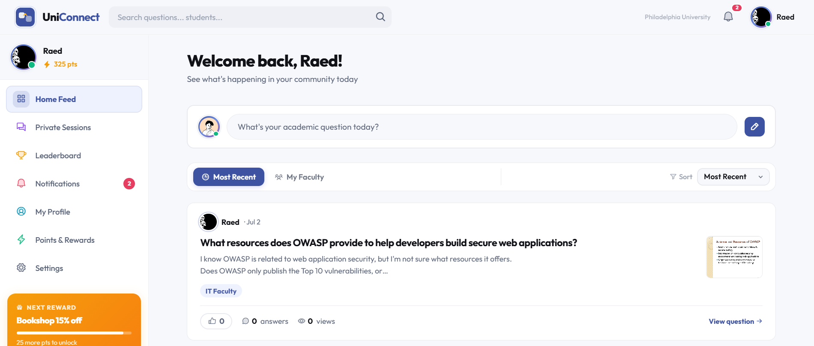
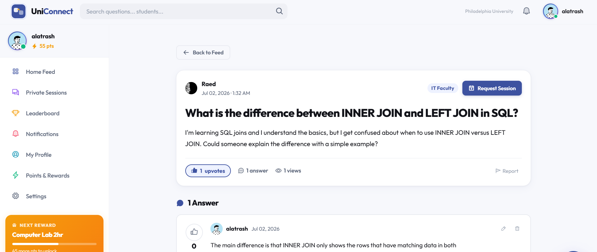
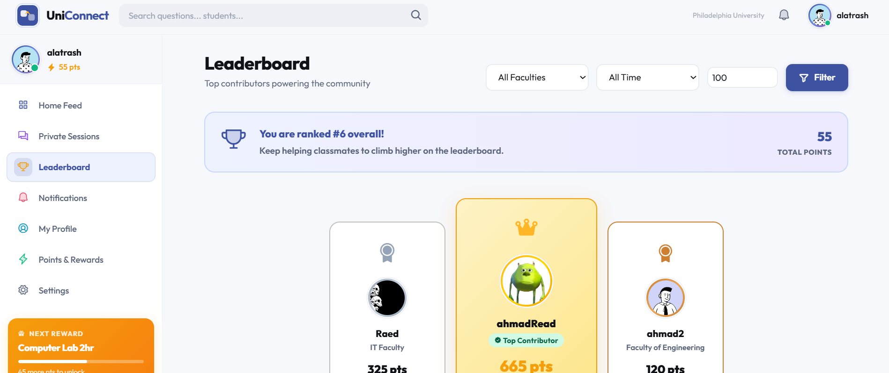
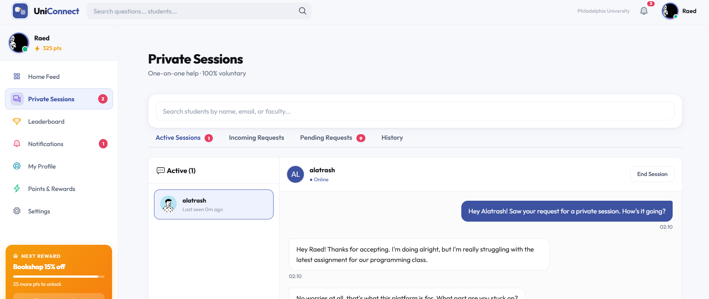

# UniConnect


**A peer-to-peer academic learning platform exclusively for Philadelphia University students.**

UniConnect connects students who need help with students who can give it — ask questions, get answers from classmates who've actually taken the course, request one-on-one tutoring, and earn points for contributing to the community.

🔗 **Live demo:** [uniconnectt-001-site1.qtempurl.com](https://uniconnectt-001-site1.qtempurl.com/)

Graduation project — Software Engineering, Philadelphia University (2025–2026).

---

## Screenshots

| Home Feed | Q&A Detail |
|---|---|
|  |  |

| Leaderboard | Private Sessions (real-time chat) |
|---|---|
|  |  |

---

## Features

- **University-only authentication** — registration restricted to `@philadelphia.edu.jo` emails, with email verification and BCrypt password hashing
- **Q&A system** — post questions, answer, mark best answer, upvote, organized by faculty and tags
- **Private tutoring sessions** — request help directly from a post, real-time chat via SignalR, session ratings and history
- **Points & gamification** — earn points for helping others, climb the leaderboard, unlock badges (e.g. Verified Tutor at 1000 pts)
- **Search** — by title, content, category, tag, faculty, or solved/unsolved status
- **Notifications** — real-time alerts for answers, upvotes, and session requests
- **Admin panel** — review reported content, manage accounts

## Points Economy

| Action | Points |
|---|---|
| Register | +50 |
| Post an answer | +5 |
| Answer upvoted | +10 |
| Marked best answer | +15 |
| Post a question | −10 |
| Award best answer | −5 |

## Tech Stack

- **Backend:** ASP.NET Core 8 MVC, Entity Framework Core 9
- **Real-time:** SignalR
- **Database:** Microsoft SQL Server
- **Auth/Security:** BCrypt password hashing, MailKit (email verification)
- **Architecture:** 5-layer (Presentation, Application, Service, Data Access, Security), MVC + Observer patterns, Dependency Injection

## Getting Started

1. Clone the repo
   ```bash
   git clone https://github.com/Ahmad-Allahawani/Uni-Connect.git
   ```
2. Open `Uni-Connect.sln` in Visual Studio (or run via CLI with the .NET 8 SDK)
3. Update the connection string in `Uni-Connect/appsettings.Development.json` to point to your SQL Server instance
4. Apply migrations
   ```bash
   dotnet tool install --global dotnet-ef
   dotnet ef database update --project Uni-Connect/Uni-Connect.csproj
   ```
5. Run the project
   ```bash
   dotnet run --project Uni-Connect
   ```

## Team

- Ahmad Alatrash
- Ahmad Allahwani
- Mostafa Maqusi
- Abdulrazzaq Qarra

**Supervisor:** Dr. Issa Ali Atoum

## License

This project is licensed under the [MIT License](LICENSE).
